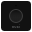
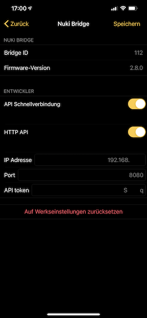

[](https://nuki.io/de/)
### Nuki Splitter (Bridge API)
[]()

Diese Modul integriert die [NUKI Bridge](https://nuki.io/de/bridge/) in [IP-Symcon](https://www.symcon.de) mittels der [Nuki Bridge HTTP-API](https://developer.nuki.io/t/bridge-http-api/26).  

Für dieses Modul besteht kein Anspruch auf Fehlerfreiheit, Weiterentwicklung, sonstige Unterstützung oder Support.  
Bevor das Modul installiert wird, sollte unbedingt ein Backup von IP-Symcon durchgeführt werden.  
Der Entwickler haftet nicht für eventuell auftretende Datenverluste oder sonstige Schäden.  
Der Nutzer stimmt den o.a. Bedingungen, sowie den Lizenzbedingungen ausdrücklich zu.

### Inhaltverzeichnis

1. [Funktionsumfang](#1-funktionsumfang)
2. [Voraussetzungen](#2-voraussetzungen)
3. [Software-Installation](#3-software-installation)
4. [Einrichten der Instanzen in IP-Symcon](#4-einrichten-der-instanzen-in-ip-symcon)
5. [Statusvariablen und Profile](#5-statusvariablen-und-profile)
6. [WebFront](#6-webfront)
7. [PHP-Befehlsreferenz](#7-php-befehlsreferenz)
8. [Bridge Callback Simulation](#8-bridge-callback-simulation)

### 1. Funktionsumfang

* Empfang von Statusinformationen der Nuki Geräte mittels WebHook
* Schaltvorgänge für die Nuki Geräte
* Nuki Bridge HTTP API Integration

### 2. Voraussetzungen

- IP-Symcon ab Version 6.0
- Nuki Bridge
- Aktivierte HTTP API Funktion der Nuki Bridge mittels der Nuki iOS / Android App
- Nuki Smart Lock 1.0, 2.0, 3.0 (Pro)
- Nuki Opener

[]()

### 3. Software-Installation

* Bei kommerzieller Nutzung (z.B. als Einrichter oder Integrator) wenden Sie sich bitte zunächst an den Autor.  
* Über den Module Store das `Nuki Bridge`-Modul installieren.  

- Sofern noch keine `Nuki Splitter (Bridge API)` Instanz in IP-Symcon vorhanden ist, so beginnen Sie mit der Installation der `Nuki Discovery (Bridge API)` Instanz.  
- Hier finden Sie die [Dokumentation](../Discovery) zur `Nuki Discovery (Bridge API)` Instanz.
 
* Alternativ können Sie die `Nuki Splitter (Bridge API)` Instanz auch manuell anlegen.  
Lesen Sie bitte dafür diese Dokumentation weiter durch.

### 4. Einrichten der Instanzen in IP-Symcon

- In IP-Symcon an beliebiger Stelle `Instanz hinzufügen` auswählen und `Nuki Splitter (Bridge API)` auswählen, welches unter dem Hersteller `NUKI` aufgeführt ist.
- Es wird eine neue `Nuki Splitter (Bridge API)` Instanz angelegt, in der die Eigenschaften zur Steuerung der Nuki Bridge gesetzt werden können.

__Konfigurationsseite__:

Name                            | Beschreibung
--------------------------------| ---------------------------------------------------
Bridge IP-Adresse               | IP-Adresse der Nuki Bridge
Bridge Port                     | Port der Nuki Bridge
Bridge API Token abrufen        | Ruft den HTTP API Token der Nuki Bridge ab
Bridge API Key verschlüsseln    | Verschlüsselt den API Token für die Kommunikation   
Bridge ID (optional)            | ID der Nuki Bridge
Netzwerk Timeout                | Netzwerk Timeout
Status automatischaktualisieren | Aktualisiert automatisch den Status mittels Webhook
Host IP-Adresse (IP-Symcon)     | IP-Adresse des IP-Symcon Host für den Webhook
Host Port (IP-Symcon)           | Port des IP-Symcon Host für den Webhook

Hinweis:  
Bei der Ersteinrichtung der Nuki Bridge mittels der Nuki iOS / Android App auf dem Smartphone wurden Ihnen die Daten angezeigt.  
Sie können den API Token in der `Nuki Splitter (Bridge API)` Instanz über `BRIDGE API TOKEN ABRUFEN` automatisch ermitteln.  
Hierfür muss die HTTP API Funktion der Nuki Bridge mittels der Nuki iOS / Android App bereits aktiviert sein.  
Es muss zwingend der HTTP API Token der Nuki Bridge verwendet werden.  
Andere API Token, wie z.B. ein Nuki Web-API Token funktionieren nicht.  
Wenn Sie Ihren API Token bereits kennen, können Sie im Entwicklerbereich diesen manuell hinzufügen.  

Für den verschlüsselten API Token (encrypted API token) wird nachfolgende Firmware der Bridge benötigt:  

Bridge 1.0, min. Beta 1.22.1  
Bridge 2.0, min. Beta 2.14.0  

[Bridge Beta Firmware](https://developer.nuki.io/c/beta-program/bridge-beta/30)

__Schaltflächen im Entwicklerbereich__:

Name                                | Beschreibung
----------------------------------- | --------------------------------------------------------------
Bridge                              | 
Token / Token übernehmen            | Manuelle Eingabe und Übernahme des HTTP API Tokens
Info anzeigen                       | Zeigt weitere Informationen der Nuki Bridge an
Logdatei anzeigen                   | Zeigt die Logdatei der Nuki Bridge an
Logdatei löschen                    | Löscht die Logdatei der Nuki Bridge
Firmware aktualisieren              | Führt eine aktualisierung der Firmware durch
Neustart                            | Starte die Nuki Bridge neu
Werkseinstellungen                  | Setzt die Nuki Brige zurück in die Werkseinstellungen
Gekoppelte Geräte anzeigen          | Zeigt die gekoppelten Nuki Geräte der Nuki Bridge an
Callback                            |
Anzeigen                            | Zeigt die angelegten Callbacks auf der Nuki Bridge an
Löschen                             | Löscht den Callback mit der definierten ID von der Nuki Bridge
  
__Vorgehensweise__:

Geben Sie die IP-Adresse, den Port, den Netzwerk-Timeout und den API Token der Nuki Bridge an.  
Mit der `Nuki Konfigurator (Bridge API)` Instanz können Sie die Geräte automatisch anlegen lassen.

__Callback__:

Für die Aktualisierung von Informationen der Nuki Geräte wird ein Callback genutzt.  
Die Registrierung des Callbacks auf der Nuki Bridge erfolgt automatisch.  
Sie können die IP-Adresse des IP-Symcon Servers und den Port für den WebHook Control (normalerweise 3777) ändern.  
Der Callback wird automatisch auf der Nuki Bridge eingetragen, sofern die Option `Status automatisch aktualisieren` aktiviert wurde.  
Über die Schaltfläche `ANZEIGEN` im Entwicklerbereich werden die registrierten Callbacks angezeigt.  
Mit der Schaltfläche `LÖSCHEN` im Entwicklerbereich kann mittels der definierte Callback ID der Callback von der Nuki Bridge wieder gelöscht werden.  

Callback URL für [WebHook Control](https://www.symcon.de/service/dokumentation/modulreferenz/webhook-control/):  

```text
http://IP-Adressse:Port/hook/nuki/bridge/InstanzID  

Beispiel:  
http://192.168.1.100:377/hook/nuki/bridge/12345
```  

Beabsichtigen Sie die `Nuki Splitter (Bridge API)` Instanz zu löschen, so löschen Sie bitte einen zuvor erstellten Callback über den Entwicklerbereich.

### 5. Statusvariablen und Profile

Die Statusvariablen/Kategorien werden automatisch angelegt.  
Das Löschen einzelner kann zu Fehlfunktionen führen.

##### Statusvariablen

Es werden keine Statusvariablen angelegt.

##### Profile:

Es werden keine Profile verwendet.

### 6. WebFront

Die Nuki Splitter Bridge API Instanz hat im WebFront keine Funktionalität.

### 7. PHP-Befehlsreferenz

```text
API aktivieren:  

NUKISB_EnableAPI(integer $InstanzID);  
Aktiviert die API Funktion, sofern über die Nuki iOS / Android App die Nutzung der API Funktion noch nicht aktiviert wurde.  
Es muss innerhalb von 30 Sekunden der Knopf auf der Nuki Bridge zur Authentifizierung gedrückt werden.  
Liefert als Rückgabewert einen json kodierten String mit dem HTTP Code und weitere Informationen über den Zustand und den API Token.  
  
$InstanzID:     Instanz ID der Nuki Bridge  

Beispiel:
$enable = NUKISB_EnableAPI(12345);
```  

```text
Authorisierung de-/aktivieren:  

NUKISB_ToggleConfigAuth(integer $InstanzID, bool $Status);  
Aktiviert oder deaktiviert die Authorisierung über `NUKISB_EnableAPI(integer $InstanzID)` und die Veröffentlichung der lokalen IP-Adresse und des Ports zur Discovery URL.  
Liefert als Rückgabewert einen json kodierten String mit dem HTTP Code und dem Status zurück.  

$InstanzID:     Instanz ID der Nuki Bridge
$Status:        false = deaktivieren, true = aktivieren  

Beispiel:  
Deaktivieren:   $deactivate = NUKISB_ToggleConfigAuth(12345, false); 
Aktivieren:     $activate = NUKISB_ToggleConfigAuth(12345, true); 
```  

```text
Gekoppelte Geräte anzeigen:  

NUKISB_GetPairedDevices(integer InstanzID);
Liefert als Rückgabewert einen json kodierten String mit dem HTTP Code und eine Liste aller verfügbaren Nuki Geräte zurück.  

Beispiel:
$devices = NUKISB_GetPairedDevices(12345);  
````  

```text
Status eines Gerätes ermitteln:  

NUKISB_GetLockState(integer InstanzID, integer $NukiID, int $DeviceType);  
Liefert als Rückgabewert einen json kodierten String mit dem HTTP Code und dem aktuellen Status eines Nuki Gerätes zurück.  

$InstanzID:     Instanz ID der Nuki Bridge  
$NukiID:        UID des Gerätes  
$DeviceType:    0 = Smart Lock, 2 = Opener  

Beispiel:  
$state = NUKISB_GetLockState(12345, 987654321, 0);  
````

```text
Gerät schalten:  

NUKISB_SetLockAction(integer $InstanzID, integer $NukiID, int $Gerätetyp, int $Aktion);  
Achtung: Es muss zusätzlich die Nuki ID zur Instanz ID des Nuki Gerätes angegeben werden!  
Liefert als Rückgabewert einen json kodierten String mit dem HTTP Code und weitere Informationen.

$InstanzID:     Instanz ID der Nuki Bridge
$NukiID:        UID des Nuki Gerätes
$Gerätetyp:     0 = Nuki Smart Lock 1.0/2.0
                2 = Nuki Opener
                3 = Nuki Smart Door
                4 = Nuki Smart Lock 3.0 (Pro)   

$Aktion:  
Führt eine Aktion für das NUKI Gerät gemäss Tabelle aus:  
```

Wert | Smart Lock                   | Opener
-----|------------------------------|---------------------------
1    | unlock                       | activate rto
2    | lock                         | deactivate rto
3    | unlatch                      | electric strike actuation
4    | lock ‘n’ go                  | activate continuous mode
5    | lock ‘n’ go with unlatch     | deactivate continuous mode

```  
Beispiel:  
Smart Lock zusperren:   NUKISB_SetLockAction(12345, 987654321, 0, 2);  
Smart Lock aufsperren:  NUKISB_SetLockAction(12345, 987654321, 0, 1);  
Türsummer betätigen:    NUKISB_SetLockAction(12345, 987654321, 2, 3);  
```

```text
Gerät entkoppeln:  

UnpairDevice(integer $InstanzID, integer $NukiID, integer $DeviceType);
Entkoppelt ein Nuki Gerät von der Nuki Bridge.
Liefert als Rückgabewert einen json kodierten String mit dem HTTP Code und weitere Informationen.

$InstanzID:     Instanz ID der Nuki Bridge
$NukiID:        UID des Nuki Gerätes
$DeviceType:    0 = Smart Lock, 2 = Opener  

Beispiel:  
$unpair = NUKISB_UnpairDevice(12345, 987654321, 0);  
```

```text
Bridge Informationen:  

NUKISB_GetBridgeInfo(integer $InstanzID);    
Zeigt alle Nuki Geräte in der Nähe an und liefert Informationen zur Nuki Bridge.  
Liefert als Rückgabewert einen json kodierten String mit dem HTTP Code und weitere Informationen.

$InstanzID:     Instanz ID der Nuki Bridge  

Beispiel:  
$info = NUKISB_GetBridgeInfo(12345);  
```  

```text
Callback anlegen:  

NUKISB_AddCallback(integer $InstanzID);    
Legt einen Callback auf der Nuki Bridge an.  
Liefert als Rückgabewert einen json kodierten String mit dem HTTP Code und weitere Informationen.

$InstanzID:     Instanz ID der Nuki Bridge  

Beispiel:  
$add = NUKISB_AddCallback(12345);
```

```text
Callback anzeigen:  

NUKISB_ListCallback(integer $InstanzID); 
Liefert als Rückgabewert einen json kodierten String mit dem HTTP Code und die angelegten Callbacks auf der Nuki Bridge.

$InstanzID:     Instanz ID der Nuki Bridge  

Beispiel:  
$add = NUKISB_ListCallback(12345);
```  

```text
Callback löschen:  

NUKISB_DeleteCallback(integer $InstanzID, integer $CallbackID);    
Löscht den Callback mit der $CallbackID auf der Nuki Bridge.  
Liefert als Rückgabewert einen json kodierten String mit dem HTTP Code und weitere Informationen.

$InstanzID:     Instanz ID der Nuki Bridge
$CallbackID:    ID des Callbacks  

Beispiel:  
$delete = NUKISB_DeleteCallback(12345, 0);
```

```text
Log anzeigen:  

NUKISB_GetBridgeLog(integer $InstanzID);
Liefert als Rückgabewert einen json kodierten String mit dem HTTP Code und das Log der Nuki Bridge an.  

$InstanzID:     Instanz ID der Nuki Bridge

Beispiel:  
$log = NUKISB_GetBridgeLog(12345);
```  

```text
Log löschen:  

NUKISB_ClearBridgeLog(integer $InstanzID);    
Löscht das Log der Nuki Bridge.  
Liefert als Rückgabewert einen json kodierten String mit dem HTTP Code und weitere Informationen.

$InstanzID:     Instanz ID der Nuki Bridge

Beispiel:  
$clear = NUKISB_ClearBridgeLog(12345);
```  

```text
Firmware aktualisieren:  

NUKISB_UpdateBridgeFirmware(integer $InstanzID);    
Prüft auf ein neues Firmware Update der Nuki Bridge und installiert es.
Liefert als Rückgabewert einen json kodierten String mit dem HTTP Code und weitere Informationen.

$InstanzID:     Instanz ID der Nuki Bridge

Beispiel:  
$update = NUKISB_UpdateBridgeFirmware(12345);
```  

```text
NUKI Bridge neu starten:  

NUKISB_RebootBridge(integer $InstanzID);    
Starte die Nuki Bridge neu.  
Liefert als Rückgabewert einen json kodierten String mit dem HTTP Code und weitere Informationen.

$InstanzID:     Instanz ID der Nuki Bridge

Beispiel:  
$update = NUKISB_RebootBridge(12345);
```  

```text
Werkseinstellungen laden:  

NUKISB_FactoryResetBridge(integer $InstanzID);    
Setzt die Nuki Bridge auf Werkseinstellungen.   
Liefert als Rückgabewert einen json kodierten String mit dem HTTP Code und weitere Informationen.

$InstanzID:     Instanz ID der Nuki Bridge

Beispiel:  
$update = NUKISB_FactoryResetBridge(12345);
```

### 8. Bridge Callback Simulation

Mit einem curl Befehl kann der Callback einer Nuki Bridge im Rahmen einer Entwicklungsumgebung simuliert werden.  
Für den normalen Gebrauch oder Einsatz der Nuki Bridge ist der curl Befehl nicht notwendig.  
Für die Verwendung von curl über die Konsole des entsprechenden Betriebssystems informieren Sie sich bitte im Internet.  

```text
curl -v -A "NukiBridge_12345678" -H "Connection: Close" -H "Content-Type: application/json;charset=utf-8" -X POST -d '{"nukiId": 987654321, "state": 1, "stateName": "locked", "batteryCritical": false}' http://127.0.0.1:3777/hook/nuki/bridge/12345
```  

* `NukiBridge_12345678` ist die ID der Nuki Bridge  
* `nukiId: 987654321` ist die ID des Nuki Smart Locks  
* `http://127.0.0.1:3777/hook/nuki/bridge/12345` ist die IP-Adresse und Port des IP-Symcon Servers inkl. Webhook
* `12345` ist die Objekt ID der Nuki Bridge in IP-Symcon