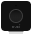

### Configurator (Bridge API)
 

Dieses Modul listet die mit der Nuki Bridge gekoppelten Geräte auf und der Nutzer kann die ausgewählten Geräte automatisch anlegen lassen.  

Für dieses Modul besteht kein Anspruch auf Fehlerfreiheit, Weiterentwicklung, sonstige Unterstützung oder Support.  
Bevor das Modul installiert wird, sollte unbedingt ein Backup von IP-Symcon durchgeführt werden.  
Der Entwickler haftet nicht für eventuell auftretende Datenverluste oder sonstige Schäden.  
Der Nutzer stimmt den o.a. Bedingungen, sowie den Lizenzbedingungen ausdrücklich zu.

### Inhaltsverzeichnis

1. [Funktionsumfang](#1-funktionsumfang)
2. [Voraussetzungen](#2-voraussetzungen)
3. [Software-Installation](#3-software-installation)
4. [Einrichten der Instanzen in IP-Symcon](#4-einrichten-der-instanzen-in-ip-symcon)
5. [Statusvariablen und Profile](#5-statusvariablen-und-profile)
6. [WebFront](#6-webfront)
7. [PHP-Befehlsreferenz](#7-php-befehlsreferenz)

### 1. Funktionsumfang

* Listet die verfügbaren Nuki Geräte der zugewiesenen Nuki Bridge auf
* Automatisches Anlegen des ausgewählten Nuki Gerätes

### 2. Voraussetzungen

- IP-Symcon ab Version 7.0
- Nuki Bridge
- Aktivierte HTTP API Funktion der NUKI Bridge mittels der NUKI iOS / Android App
- Nuki Smart Lock 1.0, 2.0, 3.0 (Pro)
- Nuki Opener

### 3. Software-Installation

* Bei kommerzieller Nutzung (z.B. als Einrichter oder Integrator) wenden Sie sich bitte zunächst an den Autor.
* Über den Module Store das `Nuki Bridge`-Modul installieren.

### 4. Einrichten der Instanzen in IP-Symcon

- In IP-Symcon an beliebiger Stelle `Instanz hinzufügen` auswählen und `Nuki Configurator (Bridge API)` auswählen, welches unter dem Hersteller `NUKI` aufgeführt ist.
- Es wird eine neue `Nuki Konfigurator (Bridge API)` Instanz unter der Kategorie `Konfigurator Instanzen` angelegt.

__Konfigurationsseite__:

| Name        | Beschreibung                              |
|-------------|-------------------------------------------|
| Kategorie   | Auswahl der Kategorie für die Nuki Geräte |
| Nuki Geräte | Liste der verfügbaren Nuki Geräte         |

__Schaltflächen__:

| Name           | Beschreibung                                                     |
|----------------|------------------------------------------------------------------|
| Alle erstellen | Erstellt für alle aufgelisteten Nuki Geräte jeweils eine Instanz |
| Erstellen      | Erstellt für das ausgewählte Nuki Gerät eine Instanz             |

__Vorgehensweise__:

Über die Schaltfläche `AKTUALISIEREN` können Sie die Liste der verfügbaren Nuki Geräte jederzeit aktualisieren.  
Wählen Sie `ALLE ERSTELLEN` oder wählen Sie ein Nuki Gerät aus der Liste aus und drücken dann die Schaltfläche `ERSTELLEN`, um das Nuki Gerät automatisch anzulegen.  
Sofern noch keine `Nuki Splitter (Bridge API)` Instanz installiert wurde, muss einmalig beim Erstellen der `Nuki Konfigurator (Bridge API)` Instanz die Konfiguration der `Nuki Splitter (Bridge API)` Instanz vorgenommen werden.  
Geben Sie die IP-Adresse, den Port, den Netzwerk-Timeout und den API Token der Nuki Bridge an.  
Bei der Ersteinrichtung der Nuki Bridge mittels der Nuki iOS / Android App auf dem Smartphone wurde Ihnen die Daten angezeigt.  
Wählen Sie anschließend `WEITER` aus.  

Sofern Sie mehrere Nuki Bridges verwenden, können Sie in der Instanzkonfiguration unter `GATEWAY ÄNDERN` die entsprechende `Nuki Splitter (Bridge API)` Instanz auswählen.  
Die `Nuki Splitter (Bridge API)` Instanz muss dafür bereits vorhanden sein.  

### 5. Statusvariablen und Profile

Die Statusvariablen/Kategorien werden automatisch angelegt.  
Das Löschen einzelner kann zu Fehlfunktionen führen.

##### Statusvariablen

Es werden keine Statusvariablen angelegt.

##### Profile:

Es werden keine Profile verwendet.

### 6. WebFront

Die Nuki Configurator Bridge API Instanz hat im WebFront keine Funktionalität.

### 7. PHP-Befehlsreferenz

Es ist keine Befehlsreferenz verfügbar.