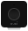
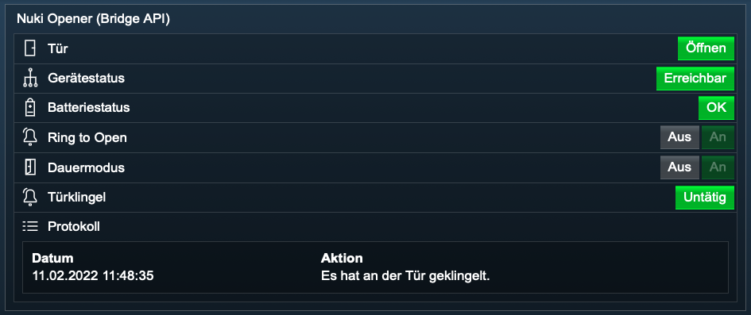

[](https://nuki.io/de/)
### Nuki Opener (Bridge API)
[]()  

Dieses Modul integriert den [Nuki Opener](https://nuki.io/de/opener/) in [IP-Symcon](https://www.symcon.de) mittels der [Nuki Bridge HTTP API](https://developer.nuki.io/t/bridge-http-api/26).  
In Verbindung mit einer Nuki Bridge macht der Nuki Opener aus deiner bestehenden Gegensprechanlage einen smarten Türöffner.  

Für dieses Modul besteht kein Anspruch auf Fehlerfreiheit, Weiterentwicklung, sonstige Unterstützung oder Support.  
Bevor das Modul installiert wird, sollte unbedingt ein Backup von IP-Symcon durchgeführt werden.  
Der Entwickler haftet nicht für eventuell auftretende Datenverluste oder sonstige Schäden.  
Der Nutzer stimmt den o.a. Bedingungen, sowie den Lizenzbedingungen ausdrücklich zu.

### Inhaltsverzeichnis

1. [Funktionsumfang](#1-funktionsumfang)
2. [Voraussetzungen](#2-voraussetzungen)
3. [Software-Installation](#3-software-installation)
4. [Einrichten der Instanzen in IP-Symcon](#4-einrichten-der-instanzen-in-ip-symcon)
5. [Statusvariablen und Profile](#5-statusvariablen-und-profile)
6. [WebFront](#6-webfront)
7. [PHP-Befehlsreferenz](#7-php-befehlsreferenz)

### 1. Funktionsumfang

* Betätigen des Türsummers / Tür (Öffnen)
* Gerätestatus anzeigen (diverse)
* Ring To Open (Aus / An)
* Dauermodus (Aus / An)
* Status der Türklingel anzeigen (Untätig / Es klingelt)
* Protokoll anzeigen

### 2. Voraussetzungen

- IP-Symcon ab Version 6.0
- Nuki Bridge
- Aktivierte HTTP API Funktion der Nuki Bridge mittels der Nuki iOS / Android App
- Nuki Opener

### 3. Software-Installation

* Bei kommerzieller Nutzung (z.B. als Einrichter oder Integrator) wenden Sie sich bitte zunächst an den Autor.
* Über den Module Store das `Nuki Bridge`- Modul installieren.

- Sofern noch keine `Nuki Splitter (Bridge API)` Instanz in IP-Symcon vorhanden ist, so beginnen Sie mit der Installation der `Nuki Discovery (Bridge API)` Instanz.  
- Hier finden Sie die [Dokumentation](../Discovery) zur `Nuki Discovery (Bridge API)` Instanz.  

* Alternativ können Sie die `Nuki Splitter (Bridge API)` Splitter Instanz auch manuell anlegen.
* Hier finden Sie die [Dokumentation](../Bridge) zur `Nuki Splitter (Bridge API)` Instanz.

- Sofern noch keine `Nuki Konfigurator (Bridge API)` Instanz in IP-Symcon vorhanden ist, so beginnen Sie mit der Installation der `Nuki Konfigurator (Bridge API)` Instanz.  
- Hier finden Sie die [Dokumentation](../Configurator) zur `Nuki Konfigurator (Bridge API)` Instanz.

* Alternativ könenn Sie den Nuki Opener auch manuell anlegen. Lesen Sie bitte dafür diese Dokumentation weiter durch.  

### 4. Einrichten der Instanzen in IP-Symcon

- In IP-Symcon an beliebiger Stelle `Instanz hinzufügen` auswählen und `Nuki Opener (Bridge API)` auswählen, welches unter dem Hersteller `NUKI` aufgeführt ist.
- Es wird eine neue `Nuki Opener (Bridge API)` Instanz angelegt.  

__Konfigurationsseite__:

| Name                                  | Beschreibung                              |
|---------------------------------------|-------------------------------------------|
| Nuki ID                               | Nuki UID des Openers                      |
| Bezeichnung                           | Bezeichnung des Openers                   |
| Status automatisch aktualisieren      | Status automatisch aktualisieren          |
| Alternativer Aktualisierungsintervall | Intervall zur alternativen Aktualisierung |
| Protokoll verwenden                   | Protokoll verwenden                       |
| Anzahl der maximalen Einträge         | Anzahl der maximalen Einträge             |

__Schaltflächen im Aktionsbereich__:

| Name                 | Beschreibung            |
|----------------------|-------------------------|
| Entwicklerbereich    |                         |
| Gerätetyp ermitteln  | Ermittelt den Gerätetyp |
| Status aktualisieren | Aktualisiert den Status |

__Vorgehensweise__:  

Geben Sie bei manueller Konfiguration die Nuki ID und eine Bezeichnung an.

### 5. Statusvariablen und Profile

Die Statusvariablen/Kategorien werden automatisch angelegt.  
Das Löschen einzelner kann zu Fehlfunktionen führen.

##### Statusvariablen

| Name            | Typ     | Beschreibung                           |
|-----------------|---------|----------------------------------------|
| Door            | integer | Öffnet die Tür                         |
| DeviceState     | integer | Status des Openers (diverse)           |
| BatteryState    | boolean | Batteriestatus (OK / Batterie schwach) |
| RingToOpen      | boolean | Ring To Open ein- / ausschalten        |
| ContinuousMode  | boolean | Dauermodus  ein- / ausschalten         |
| RingActionState | boolean | Türklingel (Untätig / Es klingelt)     |
| ActivityLog     | string  | Protokoll                              |

##### Profile:

NUKIOB.InstanzID.Name

| Name            | Typ     |
|-----------------|---------|
| Door            | integer |
| DeviceState     | integer |
| BatteryState    | boolean |
| RingActionState | boolean |

Wird die `Nuki Opener (Bridge API)` Instanz gelöscht, so werden automatisch die oben aufgeführten Profile gelöscht.

### 6. WebFront

Die Funktionalität, die das Modul im WebFront bietet:

[]()

* Betätigen des Türsummers / Tür (Öffnen)
* Gerätestatus anzeigen (diverse)
* Ring To Open (Aus / An)
* Dauermodus (Aus / An)
* Status der Türklingel anzeigen (Untätig / Es klingelt)
* Protokoll anzeigen
 
### 7. PHP-Befehlsreferenz

```text
Türsummer betätigen (Tür öffnen):  

NUKIOB_OpenDoor(integer $InstanzID);  
Betätigt den Türsummer, um die Tür zu öffnen.  
Gibt bei Erfolg als Rückgabewert true zurück, andernfalls false.  

Beispiel:  
// Öffnet die Tür  
$openDoor = NUKIOB_OpenDoor(12345); 
// Gibt den Rückgabewert aus
echo $openDoor;                     
```  


```text
Ring to Open ein- / ausschalten:  

Mit der Ring to Open Funktion wird der Türsummer deiner Gegensprechanlage betätigt, sobald jemand an der Haustür deines Wohngebäudes klingelt.  
Dein Smartphone wird erkannt, sobald du in der Nähe bist.  

NUKIOB_ToggleRingToOpen(integer $InstanzID, boolean $Status);  

$Status: false = ausschalten, true = einschalten

Gibt bei Erfolg als Rückgabewert true zurück, andernfalls false.    

Beispiele:  
// Ring To Open ausschalten
$toggle = NUKIOB_ToggleRingToOpen(12345, false);
// Gibt den Rückgabewert aus
echo $toggle;

// Ring To Open einschalten 
$toggle = NUKIOB_ToggleRingToOpen(12345, true);
// Gibt den Rückgabewert aus
echo $toggle;
```  


```text
Dauermodus ein- / ausschalten:

Wenn du den Dauermodus aktivierst, öffnet der Nuki Opener immer automatisch die Haustür, sobald jemand bei dir klingelt.
Du kannst diese Funktion jederzeit deaktivieren.  

NUKIOB_ToggleContinuousMode(integer $InstanzID, boolean $Status);  

$Status: false = ausschalten, true = einschalten    

Gibt bei Erfolg als Rückgabewert true zurück, andernfalls false. 

Beispiele:  
// Dauermodus ausschalten
$toggle = NUKIOB_ToggleContinuousMode(12345, false);
// Gibt den Rückgabewert aus
echo $toggle;

// Dauermodus einschalten 
$toggle = NUKIOB_ToggleContinuousMode(12345, true);
// Gibt den Rückgabewert aus
echo $toggle;
``` 


```text
Status aktualisieren:  

NUKIOB_UpdateOpenerState(integer $InstanzID);  
Fragt den aktuellen Status des Nuki Openers ab und aktualisiert die Werte der entsprechenden Variablen.  
Liefert keinen Rückgabewert. 

Beispiel:  
NUKIOB_UpdateOpenerState(12345);
```