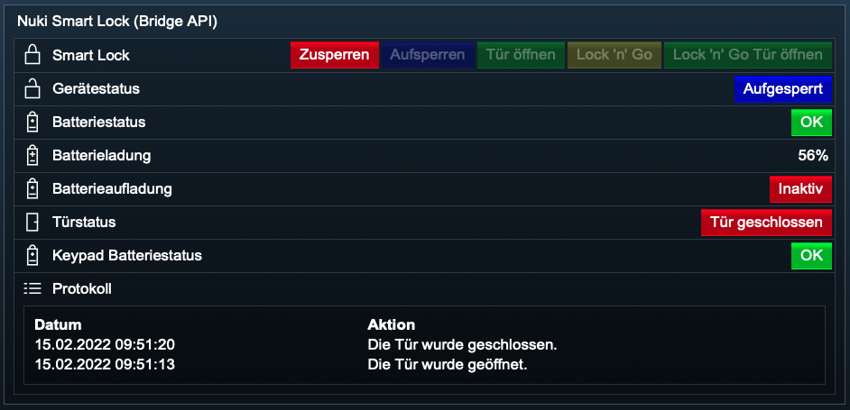

[](https://nuki.io/de/)
### Nuki Smart Lock (Bridge API)
[]()

Dieses Modul integriert das [NUKI Smart Lock](https://nuki.io/de/smart-lock/) Version 1.0, 2.0, 3.0 (Pro) in [IP-Symcon](https://www.symcon.de) mittels der [Nuki Bridge HTTP API](https://developer.nuki.io/t/bridge-http-api/26).  
In Verbindung mit einer Nuki Bridge macht das Nuki Smart Lock aus deinem Türschloss einen smarten Türöffner.

Für dieses Modul besteht kein Anspruch auf Fehlerfreiheit, Weiterentwicklung, sonstige Unterstützung oder Support.  
Bevor das Modul installiert wird, sollte unbedingt ein Backup von IP-Symcon durchgeführt werden.  
Der Entwickler haftet nicht für eventuell auftretende Datenverluste oder sonstige Schäden.  
Der Nutzer stimmt den o.a. Bedingungen, sowie den Lizenzbedingungen ausdrücklich zu.  

### Inhaltverzeichnis

1. [Funktionsumfang](#1-funktionsumfang)
2. [Voraussetzungen](#2-voraussetzungen)
3. [Software-Installation](#3-software-installation)
4. [Einrichten der Instanzen in IP-Symcon](#4-einrichten-der-instanzen-in-ip-symcon)
5. [Statusvariablen und Profile](#5-statusvariablen-und-profile)
6. [WebFront](#6-webfront)
7. [PHP-Befehlsreferenz](#7-php-befehlsreferenz)

### 1. Funktionsumfang

* Schloss zu- und aufsperren inkl. weiterer Funktionen
* Gerätestatus anzeigen (diverse)
* Informationen zum Türsensor anzeigen
* Informationen zum Keypad anzeigen

### 2. Voraussetzungen

- IP-Symcon ab Version 6.0
- Nuki Bridge
- Aktivierte HTTP API Funktion der Nuki Bridge mittels der Nuki iOS / Android App
- Nuki Smart Lock 1.0, 2.0, 3.0 (Pro)

### 3. Software-Installation

* Bei kommerzieller Nutzung (z.B. als Einrichter oder Integrator) wenden Sie sich bitte zunächst an den Autor.
* Über den Module Store das `Nuki Bridge`-Modul installieren.

- Sofern noch keine `Nuki Splitter (Bridge API)` Instanz in IP-Symcon vorhanden ist, so beginnen Sie mit der Installation der `Nuki Discovery (Bridge API)` Instanz.
- Hier finden Sie die [Dokumentation](../Discovery) zur `Nuki Discovery (Bridge API)` Instanz.

* Alternativ können Sie die `Nuki Splitter (Bridge API)` Splitter Instanz auch manuell anlegen.
* Hier finden Sie die [Dokumentation ](../Bridge) zur `Nuki Splitter (Bridge API)` Instanz.

- Sofern noch keine `Nuki Konfigurator (Bridge API)` Instanz in IP-Symcon vorhanden ist, so beginnen Sie mit der Installation der `Nuki Konfigurator (Bridge API)` Instanz.
- Hier finden Sie die [Dokumentation](../Configurator) zur `Nuki Konfigurator (Bridge API)` Instanz.

* Alternativ könenn Sie die `Nuki Smart Lock (Bridge API)` Instanz auch manuell anlegen. Lesen Sie bitte dafür diese Dokumentation weiter durch.

### 4. Einrichten der Instanzen in IP-Symcon

- In IP-Symcon an beliebiger Stelle `Instanz hinzufügen` auswählen und `Nuki Smart Lock (Bridge API)` auswählen, welches unter dem Hersteller `NUKI` aufgeführt ist.
- Es wird eine neue `Nuki Smart Lock (Bridge API)` Instanz angelegt.

__Konfigurationsseite__:

Name                                    | Beschreibung
----------------------------------------| ---------------------------------
Nuki ID                                 | Nuki UID des Smart Locks
Bezeichnung                             | Bezeichnung des Smart Locks
Status automatisch aktualisieren        | Status automatisch aktualisieren
Alternativer Aktualisierungsintervall   | Intervall zur alternativen Aktualisierung
Türsensor                               | Türsensor Informationen anzeigen
Keypad                                  | Keypad Informationen anzeigen
Protokoll verwenden                     | Protokoll verwenden
Anzahl der maximalen Einträge           | Anzahl der maximalen Einträge

__Schaltflächen im Aktionsbereich__:

Name                    | Beschreibung
----------------------- | ---------------------------------
Entwicklerbereich       |
Gerätetyp ermitteln     | Ermittelt den Gerätetyp
Status aktualisieren    | Aktualisiert den Status

__Vorgehensweise__:  

Geben Sie bei manueller Konfiguration die Nuki ID und eine Bezeichnung an.

### 5. Statusvariablen und Profile

Die Statusvariablen/Kategorien werden automatisch angelegt.  
Das Löschen einzelner kann zu Fehlfunktionen führen.

##### Statusvariablen

Name                            | Typ     | Beschreibung
------------------------------- | ------- | -------------------------------------------------------------
SmartLock                       | integer | Smart Lock Aktionen (auf- und zusperren + weitere Funktionen)
DeviceState                     | integer | Gerätestatus (diverse)
BatteryState                    | boolean | Batteriestatus (OK, Batterie schwach)
BatteryCharge                   | integer | Batterieladung (in %)
BatteryCharging                 | boolean | Batterieaufladung (In- / Aktiv)
DoorState                       | integer | Türstatus (diverse)
KeypadBatteryState              | boolean | Keypad Batteriestatus (OK, Batterie schwach)
ActivityLog                     | string  | Protokoll

##### Profile:

NUKISLB.InstanzID.Name

Name                    | Typ
----------------------- | -------
SmartLock               | integer
DeviceState             | integer
BatteryState            | boolean
BatteryCharge           | integer
BatteryCharging         | boolean
DoorState               | integer
KeypadBatteryState      | boolean

Wird die `Nuki Smart Lock (Bridge API)` Instanz  gelöscht, so werden automatisch die oben aufgeführten Profile gelöscht.

### 6. WebFront

Die Funktionalität, die das Modul im WebFront bietet:  

[]()  

* Smart Lock Aktionen (auf- und zusperren + weitere Funktionen)
* Gerätestatus anzeigen (diverse)
* Informationen zum Türsensor anzeigen
* Informationen zum Keypad anzeigen
* Protokoll anzeigen
 
### 7. PHP-Befehlsreferenz

```text
Smart Lock schalten:  

NUKISLB_SetSmartLockAction(integer $InstanzID, int $Aktion);

Schaltet eine bestimmte Aktion des Nuki Smart Locks.  
Gibt bei Erfolg als Rückgabewert true zurück, andernfalls false.  

$InstanzID:     Instanz ID des Nuki Smart Locks
$Aktion:        Führt eine Aktion für das Nuki Smart Lock gemäss Tabelle aus:  
```

Wert | Smart Lock Aktion            | Smart Lock Aktion (deutsch)          
---- | ---------------------------- | -----------------------------------------------------------
0    | lock                         | zusperren
1    | unlock                       | aufsperren
2    | unlatch                      | entriegeln
3    | lock ‘n’ go                  | automatisch aufsperren und wieder zusperren
4    | lock ‘n’ go with unlatch     | automatisch aufsperren mit entriegeln und wieder zusperren

```text
Beispiel:  
//Smart Lock zusperren
$setAction = NUKISLB_SetSmartLockAction(12345, 1); 
// Gibt den Rückgabewert aus
echo $setAction;      

//Smart Lock aufsperren
$setAction = NUKISLB_SetSmartLockAction(12345, 0);
// Gibt den Rückgabewert aus
echo $setAction;      
```

```text
Status aktualisieren:  

NUKISLB_UpdateSmartLockState(integer $InstanzID);  

Fragt den aktuellen Status des Nuki Smart Locks ab und aktualisiert die Werte der entsprechenden Variablen.  
Liefert keinen Rückgabewert.

Beispiel:  
NUKILSB_UpdateSmartLockState(12345);  
```  